# COLOR CONVERSION
# AIM:
To perform the color conversion between RGB, BGR, HSV, and YCbCr color models.

# SOFTWARE REQUIRED:

## Anaconda - Python 3.7

# ALGORITHM:

# STEP 1:

Import cv2.
# STEP 2:
Save the image in python folder that you want to perform the color conversion.

# STEP 3:
Perform color conversions for the image like RGB TO HSV,BGR TO GRAY,HSV TO RGB,RGB TO YCrCb and split and merge of HSV,RGB.

# STEP 4:
Use waitKey(0) and destroyAllWindows method to close images without errors.

# STEP 5:
Run the program and output is displayed

# PROGRAM:
### DEVELOPED BY: R.SOMEASVAR.
### REGISTER NUMBER: 212221230103.

# i) Convert BGR and RGB to HSV and GRAY:
~~~
import cv2
lambo_image=cv2.imread('lambo.jpg')
cv2.imshow('car',lambo_image)
#BGR2HSV
hsv_image=cv2.cvtColor(lambo_image,cv2.COLOR_BGR2HSV)
cv2.imshow('BGR2HSV',hsv_image)
#RGB2HSV
hsv_image1=cv2.cvtColor(lambo_image,cv2.COLOR_RGB2HSV)
cv2.imshow('RGB2HSV',hsv_image1)
#BGR2GRAY
gray_image=cv2.cvtColor(lambo_image,cv2.COLOR_BGR2GRAY)
cv2.imshow('BGR2GRAY',gray_image)
#RGB2GRAY
gray_image1=cv2.cvtColor(lambo_image,cv2.COLOR_RGB2GRAY)
cv2.imshow('RGB2GRAY',gray_image)
cv2.waitKey(0)
cv2.destroyAllWindows()
~~~
# ii)Convert HSV to RGB and BGR:
~~~
import cv2
hsv_image=cv2.imread('lambo.jpg')
cv2.imshow('Original hsv image',hsv_image)
#HSV2RGB
rgb_image=cv2.cvtColor(hsv_image,cv2.COLOR_HSV2RGB)
cv2.imshow('HSV 2 RGB',rgb_image)
#HSV2BGR
bgr_image=cv2.cvtColor(hsv_image,cv2.COLOR_HSV2BGR)
cv2.imshow('HSV 2 BGR',bgr_image)
cv2.waitKey(0)
cv2.destroyAllWindows()

~~~
# iii)Convert RGB and BGR to YCrCb:
~~~
import cv2
lam_image=cv2.imread('lambo.jpg')
cv2.imshow('original image',lam_image)
#RGB2YCrCb
ycrcb_image=cv2.cvtColor(lam_image,cv2.COLOR_RGB2YCrCb)
cv2.imshow('RGB 2 YCrCb',ycrcb_image)
#BGR2YCrCb
ycrcb_image1=cv2.cvtColor(lam_image,cv2.COLOR_BGR2YCrCb)
cv2.imshow('BGR 2 YCrCb',ycrcb_image1)
cv2.waitKey(0)
cv2.destroyAllWindows()
~~~
# iv)Split and Merge RGB Image:
~~~
import cv2
l_image=cv2.imread('lambo.jpg')
blue= l_image[:,:,0]
green= l_image[:,:,1]
red= l_image[:,:,2]
cv2.imshow('blue_image',blue)
cv2.imshow('green_image',green)
cv2.imshow('red_image',red)
merge_image=cv2.merge((blue,green,red))
cv2.imshow('merge',merge_image)
cv2.waitKey(0)
cv2.destroyAllWindows()

~~~
# v) Split and merge HSV Image:
~~~
import cv2
l_image=cv2.imread('lambo.jpg')
hsv_image=cv2.cvtColor(l_image,cv2.COLOR_BGR2HSV)
h,s,v=cv2.split(hsv_image)
cv2.imshow('H',h)
cv2.imshow('S',s)
cv2.imshow('V',v)
merge=cv2.merge((h,s,v))
cv2.imshow('MERGE',merge)
cv2.waitKey(0)
cv2.destroyAllWindows()
~~~
# OUTPUT:
## ORIGINAL IMAGE:
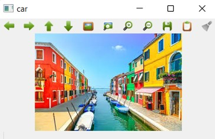
## i) BGR and RGB to HSV and GRAY:
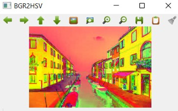
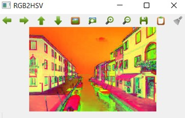
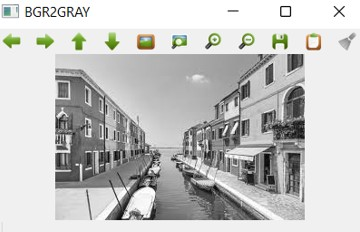
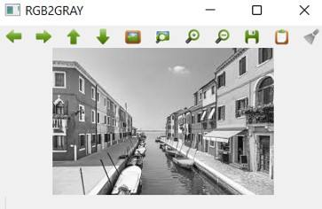

## ii) HSV to RGB and BGR:
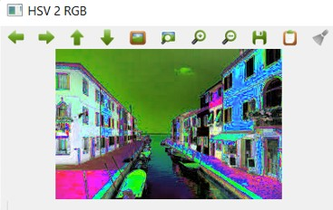
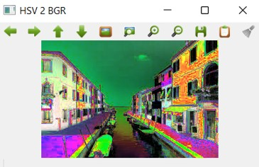

## iii) RGB and BGR to YCrCb:
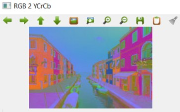
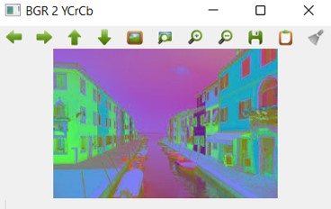

## iv) Split and merge RGB Image:
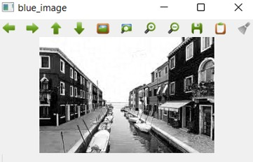
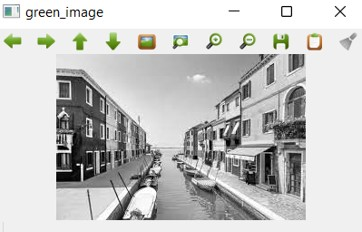
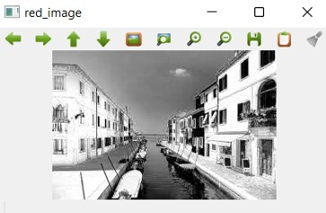
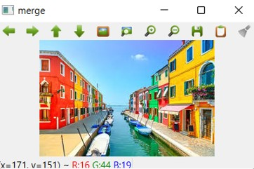

## v) Split and merge HSV Image:
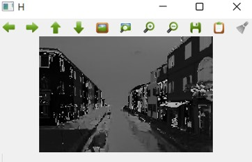
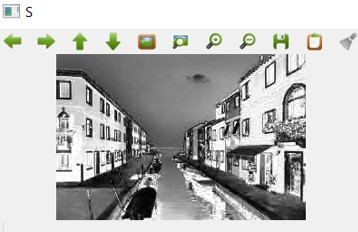
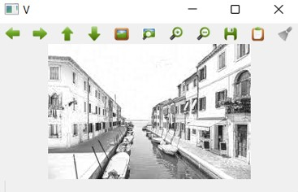
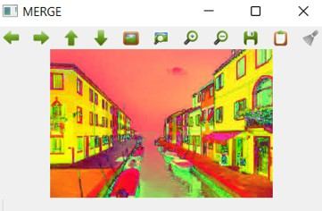

# RESULT:
Thus the color conversion was performed between RGB, HSV and YCbCr color models.
